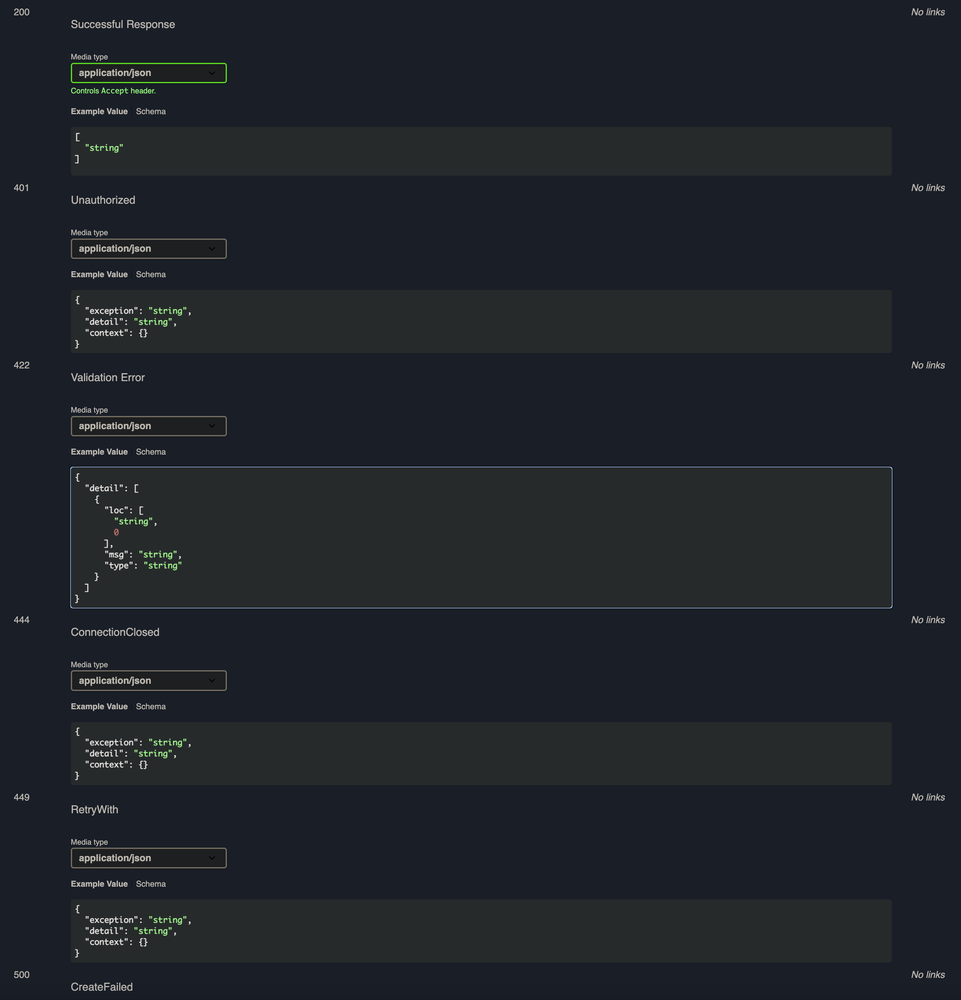

### Find application-specific custom exceptions
- If implementing [custom exception handlers](https://fastapi.tiangolo.com/tutorial/handling-errors/?h=custom+exceptio#install-custom-exception-handlers), responses for your custom `Exception` types can also be documented. They can be included by passing a `customError` argument to the `custom_openapi` function.
- The `customError` needs to inherit from the Python `Exception` class. Each `customError` and subclass of `customError` should be instantiable without required arguments. i.e. if you are parameterising your custom exceptions, they should have defaults in their class constructor. If you use required positional arguments in your `customError` constructors, `fastapi-docx` will throw an error when attempting to evaluate your custom Exception from source code.
- If using custom exception handlers, you can pass your `customError` Base class, along with a Pydantic `customErrSchema` to the `custom_openapi` function when creating your OpenAPI spec:

```Python
from typing import Any

from fastapi import Request
from fastapi.utils import is_body_allowed_for_status_code
from pydantic import BaseModel
from starlette.responses import JSONResponse, Response

from fastapi_docx.openapi import custom_openapi


class AppExecptionSchema(BaseModel):
    exception: str | None = None
    detail: str | None = None
    context: dict[str, Any] | None = None


class AppExceptionCase(Exception):
    def __init__(
        self,
        status_code: int,
        detail: str,
        context: dict[str, Any] | None = None,
        headers: dict[str, Any] | None = None,
    ):
        self.case = self.__class__.__name__
        self.status_code = status_code
        self.headers = headers
        self.detail = detail
        self.context = context or ""


async def app_exception_handler(
    request: Request, exc: AppExceptionCase
) -> JSONResponse:
    if not is_body_allowed_for_status_code(exc.status_code):
        return Response(status_code=exc.status_code, headers=exc.headers)
    return JSONResponse(
        status_code=exc.status_code,
        headers=exc.headers,
        content={
            "exception": exc.case,
            "detail": exc.detail,
            "context": exc.context,
        },
    )


class AppExc:
    class CreateFailed(AppExceptionCase):
        def __init__(self, context: dict[str, Any] | None = None):
            self.context = context or {}
            status_code = 500
            obj = self.context.get("obj", "object")
            detail = f"{obj} creation failed"
            super().__init__(status_code, detail)

    class ConnectionClosed(AppExceptionCase):
        def __init__(self) -> None:
            status_code = 444
            detail = "Conection closed without response"
            super().__init__(status_code, detail)

    class Unauthorized(AppExceptionCase):
        def __init__(self, context: dict[str, Any] | None = None):
            status_code = 401
            detail = "permission required"
            super().__init__(status_code, detail, context)


class RetryWith(AppExceptionCase):
    def __init__(self, context: dict[str, Any] | None = None):
        status_code = 449
        detail = "Retry the request"
        super().__init__(status_code, detail, context)


app = FastAPI()


@app.get("/")
def get_user(user_in):
    if not user_in:
        raise AppExc.CreateFailed({"obj": "User"})
    elif user_in == "John":
        raise RetryWith(context="abc")
    elif user_in == "Saran":
        raise AppExc.ConnectionClosed()
    elif user_in == "Sam":
        raise AppExc.Unauthorized({"obj": "User", "name": "Sam"})
    return user_in


@app.exception_handler(AppExceptionCase)
async def custom_app_exception_handler(request, e):
    return await app_exception_handler(request, e)


app.openapi = custom_openapi(
    app,
    customError=AppExceptionCase,
    customErrSchema=AppExecptionSchema,
)

```

- Visiting <a href="http://localhost:8080/docs" class="external-link" target="_blank">http://localhost:8080/docs</a> (or whatever host and port your app is running on), should display the below documented responses:



!!! note
    For adding different schemas to the default `HTTPExcSchema` for `HTTPException` responses, see [Response Schemas](../response-schemas/index.md){.internal-link target=_blank}.
